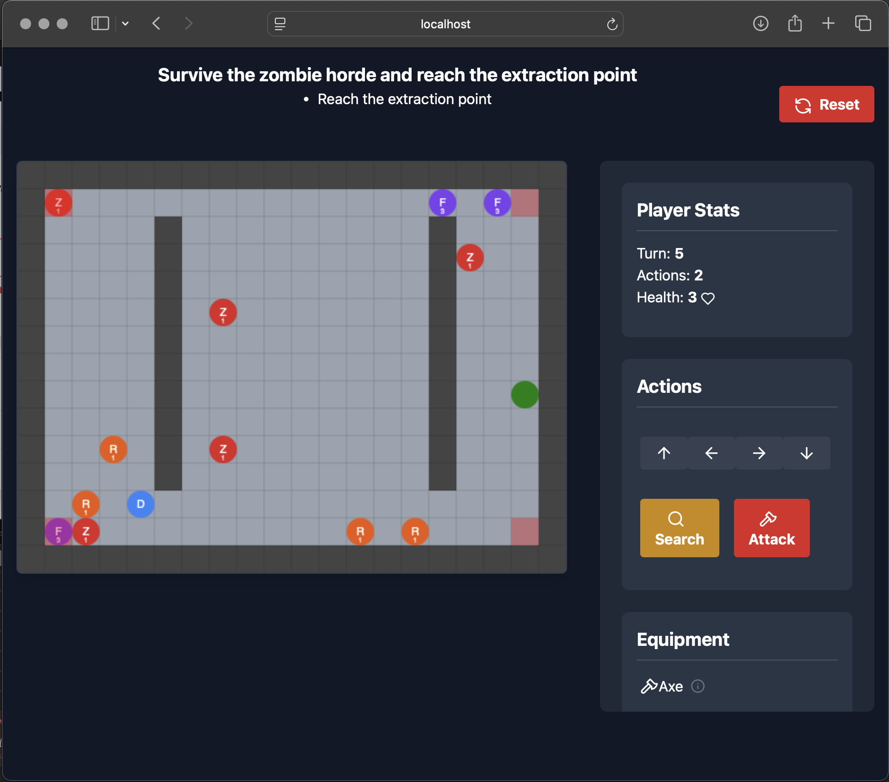
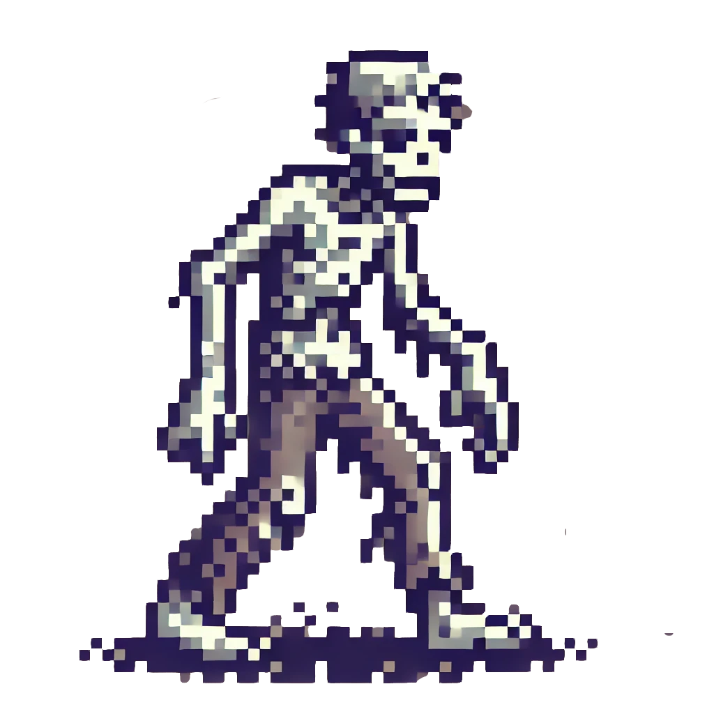
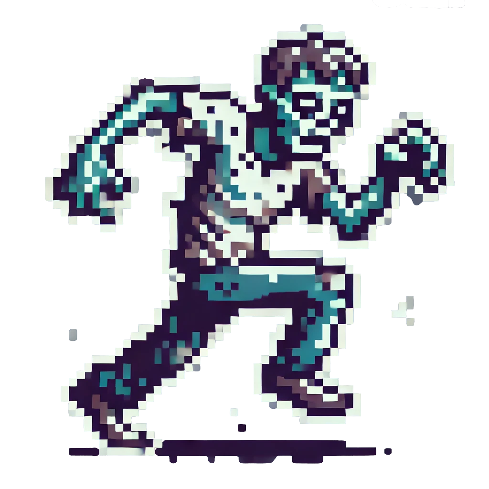
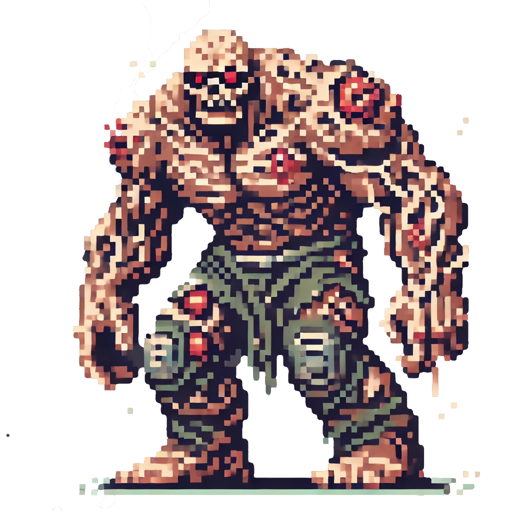

# Hamster Game

A thrilling survival game where hamsters must defend against waves of zombies!

Check it out , or follow the steps below to setup a local instance.

## Screenshots







## Technologies Used

- React with TypeScript
- Vite build tool
- Tailwind CSS for styling
- PostCSS for CSS processing

## Getting Started

1. Clone the repository
2. Install dependencies:
   ```bash
   npm install
   ```
3. Start development server:
   ```bash
   npm run dev
   ```
4. Open  in your browser; adjust the URL if your node app is using a different port.

## Game Features

- Choose your hamster character
- Defend against different zombie types
- Strategic gameplay with equipment and stats
- Multiple maps and missions
